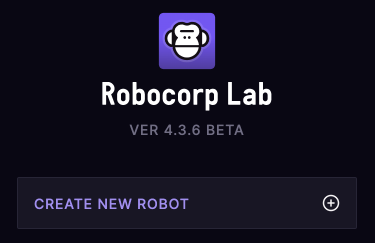

# Training - RPA Developer

[Robocorp](https://robocorp.com/) makes RPA accessible to everyone through license-free open source technologies, delivered from a cloud platform. Join us and learn to build and orchestrate software robots with Robocorp's developer tools and [RPA Framework's](https://rpaframework.org/) open-source libraries.

The goal is to offer well-documented and actively maintained core libraries for Software Robot Developers.

## Final exam

This final exam is a way for us to test that you have understood the concepts of Robocorp, and are able to build a robot on your own. The target of the final exam is to build Final exam robot in Python or Robot Framework syntax using Robocorp Lab or VSCode extension. The robot should be runnable locally via Lab (or VSCode) and also runnable from Robocorp Cloud using container. Feel free to ask for guidance from your team mates, or on Robocorp slack (channel #rpa-developer-training). However, please note that we go through all the final exam robots, so make sure you do not copy-paste a ready-built solution.

### Expected results:
1. Robot in Python or RFW format which completes final exam assignment
2. Robot gets some run specific information from the [Vault](https://robocorp.com/docs/development-guide/variables-and-secrets/vault) (e.g. the email address)
4. Robot can be run locally with Lab
5. Robot can be run from Cloud using Robocontainer
7. Email is sent to the above-mentioned address with expected title and attachment

Send your final robot to email address training@robocorp.com.

## Prerequisites ☝️

- Create a [Robocorp](https://robocorp.com/) account.
- A) Install [Visual Studio Code](https://code.visualstudio.com/) with the [Robocorp extensions](https://robocorp.com/docs/product-manuals/robocorp-code) OR
- B) Install [Robocorp Lab](https://robocorp.com/download).


### I love command-line! Any tools available for me?

Try [RCC](https://robocorp.com/docs/product-manuals/rcc/rcc-overview) (a command-line tool that allows you to create, manage, and distribute Python-based self-contained automation packages - or robots 🤖 as we call them.)!

- See [RCC installation instructions](https://robocorp.com/docs/product-manuals/rcc/rcc-installation).
- View the [RCC workflow example](https://robocorp.com/docs/product-manuals/rcc/rcc-workflow).                                                                                     |
## Robocorp automation stack


## Short intro of the process you are going to automate 🎥


The process intro is available as a [video](https://youtu.be/0uvexJyJwxA).

## Rules for the robot 📚

> My dear, without rules there's only chaos. _- Star Wars: The Clone Wars: Senate Murders (2010)_

- The robot should use the [orders file](https://robotsparebinindustries.com/orders.csv) (`.csv` ) and complete all the orders in the file.

```csv
Order number,Head,Body,Legs,Address
1,1,2,3,Address 123
2,4,1,5,Address 456
3,6,2,3,Address 789
4,2,3,2,Address 1
5,3,5,1,Address 2
6,1,6,6,Address 3
7,5,1,5,Address 4
8,2,3,3,Address 5
9,3,2,2,Address 6
10,4,4,2,Address 7
11,6,6,1,Address 8
12,1,3,3,Address 9
13,1,5,4,Address A
14,3,1,5,Address B
15,3,2,6,Address C
16,6,3,6,Address D
17,5,4,1,Address E
18,2,5,1,Address F
19,4,6,2,Address G
20,1,1,5,Address H
```


- Only the robot is allowed to get the orders file. You may not save the file manually on your computer.
- The robot should save the order HTML receipt as a PDF file.
- The robot should save a screenshot of the ordered robot.
- The robot should embed the screenshot of the robot to the PDF receipt.


- The robot should create a ZIP archive of the receipts and the images.
- The robot should complete all the orders even when there are technical failures with the robot order website. Hint: You need to implement some retry logic.

## Task 1: Complete the order process manually

Before you start with automation, complete the order process manually to see how it works. It is easier to automate a process you are familiar with:

https://robotsparebinindustries.com/#/robot-order

## Task 2: Create a new template robot with Visual Studio Code, RCC, or Robocorp Lab.

You do not have to start from scratch. The Visual Studio Code extension, RCC, and Robocorp Lab can create a simple template robot for you.

### Option A - Visual Studio Code


- Press `Shift-Command-P` (macOS) or `Ctrl+Shift+P` (Windows / Linux) to open the Command Palette.
- Select `Robocorp: Create Robot`.
- Select the `standard` template.
- Enter a name for the robot.

### Option B - RCC

- Use the interactive robot creation command:

```bash
rcc create
```

- Enter a name for the robot (or accept the default `my-first-robot` by pressing `Enter`).
- Select the `standard` template by pressing `3`.

### Option C - Robocorp Lab



- Click `Create new robot`.
- Enter a name for the robot.

## Task 3: Open the `tasks.robot` file inside the created robot directory


- This is the standard template robot.
- It uses Robot Framework syntax.
- This is the only file you need to modify in this workshop.

## Task 4: Run the robot

### Visual Studio Code

- Open the Command Palette.
- Select `Robocorp: Run Robot`.
- (or navigate to the task you want to run by clicking the Robocorp icon in the Activity Bar on the left)

### RCC

```bash
rcc run
```

### Robocorp Lab

- Click the `Run Robot` button.

## Task 5: View the robot log

When run, the robot should log a greeting.

### Visual Studio Code


- `Command-Click` (macOS) or `Ctrl+Click` (Windows / Linux) the path to the log file in the debug console. This opens the log as a HTML file. You can install the [open in browser](https://marketplace.visualstudio.com/items?itemName=techer.open-in-browser) extension and press `Option-B` (macOS) or `Alt+B` (Windows / Linux) to open the HTML file in your default browser.

You can leave the log tab open in your browser and return to it whenever you want to check the log. Just remember to refresh the page to see the changes!

### Robocorp Lab


- View the log by pressing the `Log` button.

## Task 6: Update the robot description

A good description goes a long way in communicating the purpose and the task of your robot.

- Describe your robot using `Documentation` in the `*** Settings ***` section.
- Use [`...` syntax](https://robocorp.com/docs/robot-framework-for-rpa/robot-framework-syntax#splitting-data-into-several-rows) to split the text into multiple lines.

```robot
*** Settings ***
Documentation     Orders robots from RobotSpareBin Industries Inc.
...               Saves the order HTML receipt as a PDF file.
...               Saves the screenshot of the ordered robot.
...               Embeds the screenshot of the robot to the PDF receipt.
...               Creates ZIP archive of the receipts and the images.
```

## Task 7: Update the name of the task

A well-named task summarizes the thing that the robot is supposed to complete.

```robot
*** Tasks ***
Order robots from RobotSpareBin Industries Inc
```

## Build the rest of the robot! 😀

If you have prior experience with Robot Framework and automation, you can proceed, however you like. Try to build a robot that does the manual process automatically, completing all the orders in the `.csv` file (even when there are occasional errors with the website)!

Here is some inspiration for what the finished `*** Tasks ***` section _might look like_. Take it only as inspiration. You do not need to follow it blindly, but it can be useful for determining what steps need to be implemented so that the robot can complete the process. You could reach the end goal in many ways!

> You _could_ implement all the things inside the `Tasks` section without defining any custom keywords, but the end result might be easier to maintain if you use well-named keywords that do only one thing but do it well (just like in programming in general; short functions that do only one thing, but do it well!).

The task calls custom keywords, such as `Open the robot order website`, `Get orders`, and `Close the annoying modal`. None of these keywords exist in Robot Framework or third-party libraries. They are just plain English keywords to make the intention of the robot more clear.

Each of these keywords needs to be implemented. Otherwise, they do nothing. If you want to, you can try and implement the keywords one by one until the full process is automated. Good luck!

```robot
*** Tasks ***
Order robots from RobotSpareBin Industries Inc
    Open the robot order website
    ${orders}=    Get orders
    FOR    ${row}    IN    @{orders}
        Close the annoying modal
        Fill the form    ${row}
        Preview the robot
        Submit the order
        ${pdf}=    Store the receipt as a PDF file    ${row}[Order number]
        ${screenshot}=    Take a screenshot of the robot    ${row}[Order number]
        Embed the robot screenshot to the receipt PDF file    ${screenshot}    ${pdf}
        Go to order another robot
    END
    Create a ZIP file of the receipts
```

Since none of the keywords are implemented yet, running the robot will not succeed. One way to proceed could be to comment out all the other keyword calls but the one that you are currently implementing, like here, where we leave `Open the robot order website` uncommented, and comment out everything else:

```robot
*** Tasks ***
Order robots from RobotSpareBin Industries Inc
    Open the robot order website
    # ${orders}=    Get orders
    # FOR    ${row}    IN    @{orders}
    #     Close the annoying modal
    #     Fill the form    ${row}
    #     Preview the robot
    #     Submit the order
    #     ${pdf}=    Store the receipt as a PDF file    ${row}[Order number]
    #     ${screenshot}=    Take a screenshot of the robot    ${row}[Order number]
    #     Embed the robot screenshot to the receipt PDF file    ${screenshot}    ${pdf}
    #     Go to order another robot
    # END
    # Create a ZIP file of the receipts
```

All the lines beginning with the comment sign (`#`) are ignored when running your robot. As you progress, you can start removing the comment signs!

## Task 8: Open the robot order website

To get things started, you need to implement a keyword for opening the robot order web site. Here's a draft for the keyword. You need to add the implementation (calling keywords to accomplish things):

```robot
*** Keywords ***
Open the robot order website
    Replace this line with a suitable keyword
```

> **Visual Studio Code**: You can place the `*** Keywords ***` section either before or after the `*** Tasks ***` section. The order does not matter. You only need one `*** Keywords ***` section heading at the top; no need to add one for each of the keywords.

> **Robocorp Lab**: You need to place the `*** Keywords ***` section _before_ the `*** Tasks ***`, since the Notebook is parsed from top to bottom. If you want to split each keyword in its own cell, add the `*** Keywords ***` section heading on top of each of the keywords. Otherwise, they will all be in the same cell. Up to you!

### Hints

- You need a library that knows how to work with a web browser.
- You can try searching for a web browser library on [Robocorp docs](https://robocorp.com/docs/).
- You might want to use a keyword that handles installing the browser drivers for you (read the keyword descriptions to find one that does this).
- After you find a suitable keyword/library, you need to import the library to your robot script. See the [basic concepts](https://robocorp.com/docs/robot-framework-for-rpa/basics-of-robot-framework) article for tips on importing a library.
- After importing the library, call the keyword for opening the browser. See the keyword documentation for the required arguments for the keyword you are using. You might need to provide the URL of the robot order website!

When you get the robot order website to open in a web browser, you can proceed to the next task!

## Task 9: Download the orders file, read it as a table, and return the result

```robot
${orders}=    Get orders
```

### Hints

- The file is here: https://robotsparebinindustries.com/orders.csv
- You need an RPA Framework library for downloading things.
- You want to overwrite the downloaded file if it exists to be able to run your robot over and over again. There is a keyword argument for telling that overwriting is ok!
- There is an RPA Framework library for reading CSV files into tables that can then be looped in a robot script.
- You need your custom `Get orders` keyword to _return_ the result. See the [keywords](https://robocorp.com/docs/robot-framework-for-rpa/robot-framework-keywords) article in Robocorp docs. There's a section about [returning](https://robocorp.com/docs/robot-framework-for-rpa/robot-framework-keywords#user-keywords-with-return-values) things from a keyword.
- Learn about [assigning variables](https://robocorp.com/docs/robot-framework-for-rpa/robot-framework-variables#assigning-variables).

> You can check if your code works from the log after you run your robot.

## Task 10: Loop the orders

You need to complete the ordering process for each of the orders.

### Hints

- You need to use a [loop](https://robocorp.com/docs/robot-framework-for-rpa/how-to-use-for-loops).
- For now, you can just log each row inside the loop.
- The task draft already contains valid loop syntax, so you can steal that if you like!

## Task 11: Give up all your constitutional rights!

Time to get rid of that annoying modal that pops up when you open the robot order website. Let's implement the `Close the annoying modal` keyword.

### Hints

- You have already imported the library you need.
- Keywords that click on things might prove useful here.
- The "click on stuff" keywords need a [locator](https://robocorp.com/docs/development-howtos/browser/how-to-find-user-interface-elements-using-locators-in-web-applications) so that they know what to click on. Locators are the bread and butter of automating web applications. It is good to spend some time reading about those. Practice makes perfect!
- You can use the browser inspector tools to find the elements to click on.
- You can target HTML elements either with CSS [type](https://developer.mozilla.org/en-US/docs/Web/CSS/Type_selectors), [class](https://developer.mozilla.org/en-US/docs/Web/CSS/Class_selectors), [ID](https://developer.mozilla.org/en-US/docs/Web/CSS/ID_selectors), or [attribute](https://developer.mozilla.org/en-US/docs/Web/CSS/Attribute_selectors) selectors or [XPath](https://robocorp.com/docs/development-howtos/browser/how-to-find-user-interface-elements-using-locators-in-web-applications#other-locator-strategies-xpath) expressions.
- You can use the [locator auto-completion in Robocorp Lab](https://robocorp.com/docs/product-manuals/robocorp-lab/locating-and-targeting-user-interface-elements-in-robocorp-lab#locator-auto-completion-for-browsers).

## Task 12: Fill the form

Time to tackle the `Fill the form` keyword. This example keyword takes an argument.

### Hints

- Check the docs on using [arguments](https://robocorp.com/docs/robot-framework-for-rpa/robot-framework-keywords#user-keywords-with-arguments).
- Use the order row that you got from the loop you built as the argument for this form filler keyword.
- If the name of the variable you got from the loop is, for example, `${row}`, you can access the value of the `Head` column like this: `${row}[Head]`.
- You need keywords for selecting things and inputting text. You have the library you need already imported!
- The input for the leg number is slightly annoying. It _does_ have an `id` attribute, but the value seems to change all the time! 🤬 Can you think of a way of targeting that element? There are no "correct" answers here; just many options!

## Task 13: Preview the robot

To robotically get the image of the robot, the robot needs to preview the robot.

### Hints

- Click on stuff. Business as usual!

## Task 14: Submit the order

This one is a bit trickier case. Sometimes the submit fails. We really want the robot to complete the orders even when there are occasional errors on submit. How do we do that? 🤔

### Hints

- See the [how to handle task failures](https://robocorp.com/docs/development-howtos/qa-and-best-practices/how-to-handle-task-failures-tutorial) article.
- The [web store order robot](https://robocorp.com/docs/development-howtos/browser/web-store-order-robot) also has an example of retrying keyword calls.

## Task 15: Store the receipt as a PDF file

```robot
${pdf}=    Store the receipt as a PDF file    ${row}[Order number]
```

### Hints

- You need to import an RPA Framework library that handles PDF files.
- The keyword needs to take an argument (the order number; to be used in the file name) and return a result (the file system path to the PDF file).
- The [Beginners' course](https://robocorp.com/docs/courses/beginners-course/creating-pdf#getting-the-html-table-element-out-of-the-page) contains a chapter about this exact topic.
- You want to store the PDF files inside the `output` directory (you can use subdirectories such as `receipts` inside the `output` dir if you like), since that location is supported by Robocorp Cloud when it stores the process artifacts. If you place stuff elsewhere, it will not end up in Robocorp Cloud process artifacts.
- There is a [runtime variable](https://robocorp.com/docs/robot-framework-for-rpa/robot-framework-variables#runtime-variables) for the output directory path. Can you find it?
- The directory path separator is operating-system-specific. There is a [built-in variable](https://robocorp.com/docs/robot-framework-for-rpa/robot-framework-variables#built-in-variables) for that separator.

## Task 16: Take a screenshot of the robot

```robot
${screenshot}=    Take a screenshot of the robot    ${row}[Order number]
```

### Hints

- This is similar to the last keyword you implemented (takes an argument, returns a result).
- You have the library you need already imported.

## Task 17: Embed the robot screenshot to the receipt PDF file

```robot
Embed the robot screenshot to the receipt PDF file    ${screenshot}    ${pdf}
```

### Hints

- You have the library you need already imported.
- Before you can write to a PDF document, you need to open it for writing.
- After writing to a PDF document, it is good to close it.

## Task 18: Go to order another robot

If you got this far, this might be pretty straight-forward! Congratulations!

## Task 19: Create a ZIP file of the receipts

If you want to run your robots in Robocorp Cloud and get access to the robot output artifacts (such as the files the robot generates), you want to store the files in the `output` directory. Since Robocorp Cloud does not support subdirectories for the output artifacts, you need to ZIP the receipt PDFs.

### Hints

- You need an RPA Framework library that can create ZIP archives.
- The [PDF invites creator](https://robocorp.com/docs/development-howtos/pdf/pdf-invites-printer) has an example of creating a ZIP archive.

## Bonus challenge 1

The default behavior for browser automation is to save a screenshot whenever a keyword fails.

Unnecessary screenshots make the robot log files unnecessarily large. Unnecessary screenshots are those that are taken when retrying a step that you know might fail. Since you know that these steps might fail from time to time, you are not interested in the screenshots for those failures.

Try to improve the robot so that it does not take unnecessary screenshots.

### Hints

- Learn about [muting the run-on-failure functionality](https://robocorp.com/docs/development-howtos/browser/how-to-handle-website-notices-if-they-appear).

---

## Part II: Run the robot in Robocorp Cloud

### Connect to Robocorp Cloud

#### Visual Studio Code

- [Log in to Robocorp Cloud from Visual Studio Code](https://robocorp.com/docs/product-manuals/robocorp-code#logging-in-to-robocorp-cloud-from-visual-studio-code)

#### Robocorp Lab

- [Link Robocorp Lab with Robocorp Cloud](https://robocorp.com/docs/product-manuals/robocorp-lab/linking-robocorp-lab-to-robocorp-cloud).

### Upload the robot to Robocorp Cloud

- [Upload the robot code to Robocorp Cloud](https://robocorp.com/docs/product-manuals/robocorp-cloud/configuring-robots-for-running-in-robocorp-cloud#upload-the-robot-code-to-robocorp-cloud)

### Run the robot in Robocorp Cloud

- [Create a new process and run it](https://robocorp.com/docs/product-manuals/robocorp-cloud/configuring-robots-for-running-in-robocorp-cloud#workforce-robot)

## Bonus challenge 2

After running the robot in the cloud, and downloading the zip archive, you might notice that the robot image does not fully fit on the PDF document. 🤔

### Tips

- I wonder if the default browser window size is too small when running in headless mode...

## Troubleshooting

### RPA Framework keywords are not recognized by the IDE!

- Try changing the `rpaframework` version in `conda.yaml` file to `6.7.2`. Close and reopen the `tasks.robot` file.

## Can I stop the execution mid-run and inspect what is happening inside the robot?

Yes! You can debug your script in VS Code:

- Add a breakpoint on the line(s) you want.
- Click on the Robocorp icon in the Activity Bar on the left.
- Run the robot using the debug button.


